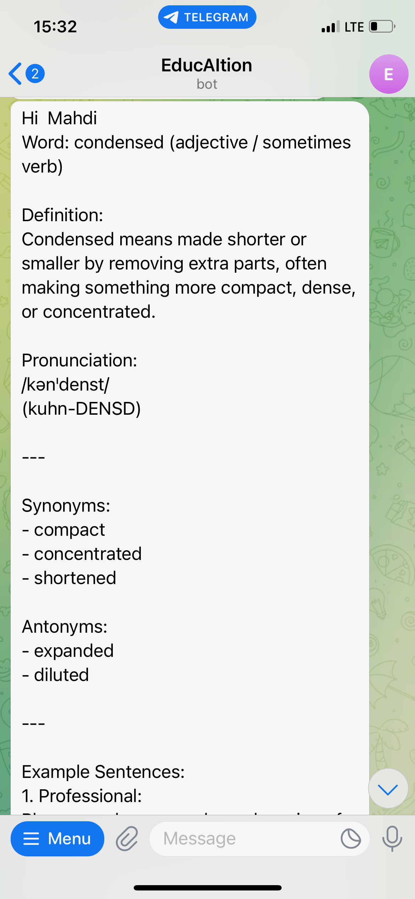
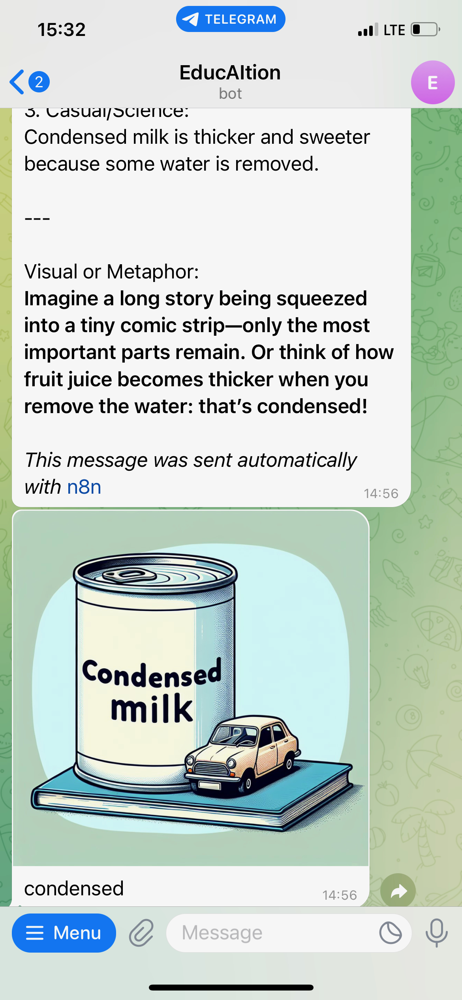
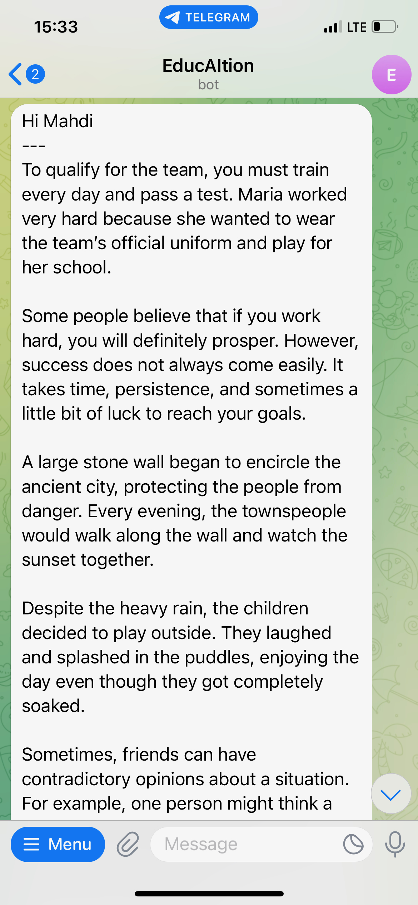
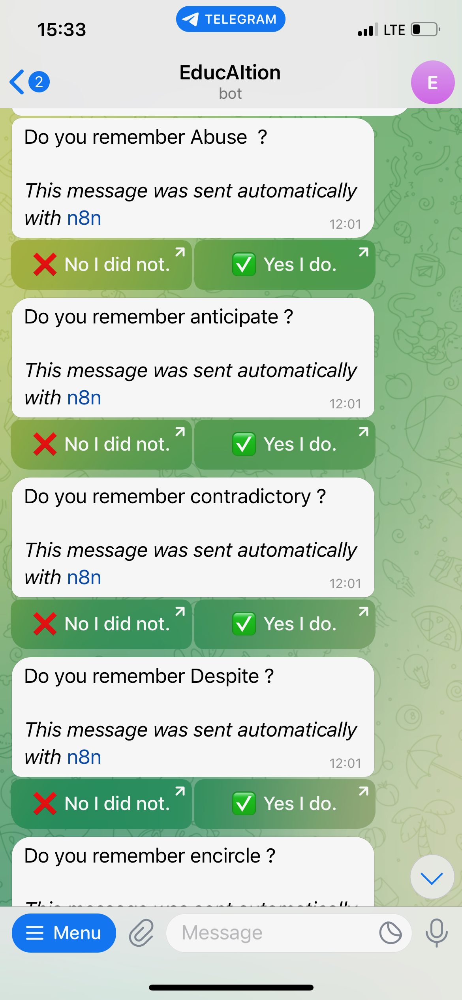
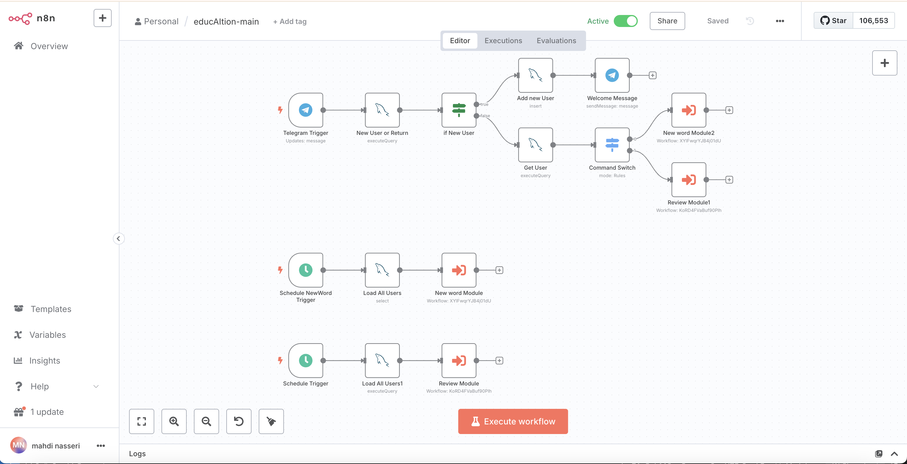
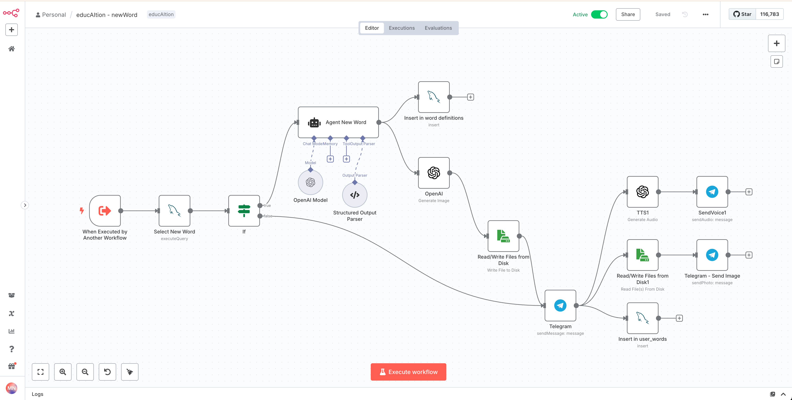
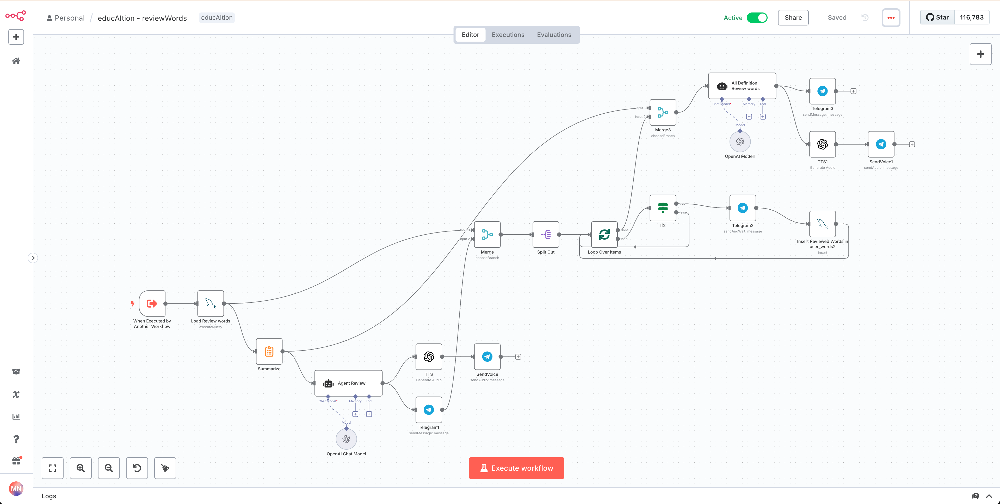
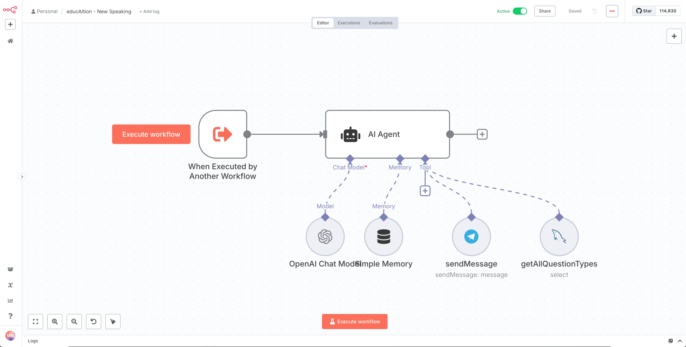
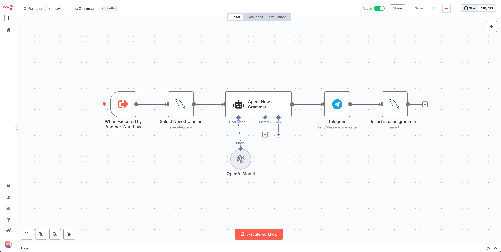
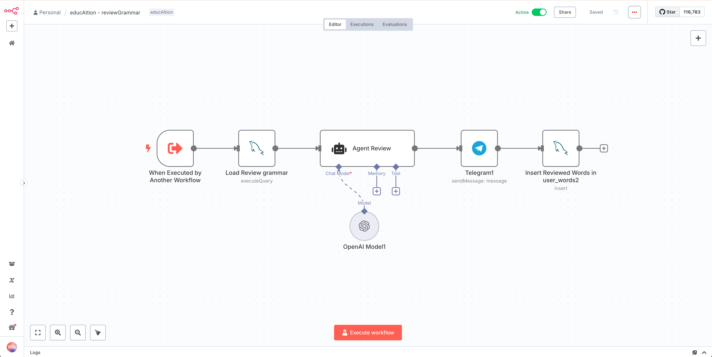

# educAItion - AI-Powered English Learning That Sticks

Hi! I built **educAItion** because I was struggling to learn English effectively — despite attending many courses and using countless apps. One tool that really helped me before was the [Leitner system](https://en.wikipedia.org/wiki/Leitner_system), which is a proven technique for remembering vocabulary through spaced repetition.

At some point, I thought:

> *“What if I could bring AI into the mix and build something that fits exactly what I need?”*

And that’s how educAItion was born.

---

## What is educAItion?

**educAItion** is a Telegram bot that helps users learn English vocabulary using a smart blend of the **Leitner box technique** and **OpenAI’s language model**.

It sends users new words every day, generates personalized mini-lessons and AI-generated illustrations, and reminds them to review past words — all based on their progress. It's a fully automated, personal English tutor running 24/7 inside Telegram.

🧪 **Note:** This project is currently in the experimental phase. If the results are promising, I plan to release the bot for public use so others can benefit from it too.

---

## How It Works

* **Signup:**
  Users simply message the Telegram bot to get started. No registration forms, no accounts. Just say hi.

* **New Words Daily:**
  Each day, three random English words are selected for every user at different schaduled times. For each word:

  * An educational text is generated using OpenAI's API.
  * An AI-generated image is created to support visual memory.
  * All of it is delivered directly to the user's Telegram.
  
     

* **Spaced Repetition (Leitner System):**
  Once a day, the bot reviews words that need to be revised based on the Leitner method.

  * The bot sends a recap lesson generated by AI.
  * The user is asked whether they remembered the word.

    * If **yes**, the word moves up a box (reviewed less frequently).
    * If **no**, the word moves back to the first box (reviewed daily).

  

* **Speaking Practice Module:**

  The user is presented with a question modeled after common IELTS and TOEFL speaking prompts. The user responds with a voice message, which is then analyzed. Based on the analysis, a voice reply is generated and sent back to the user. This reply includes personalized feedback on their performance, corrections if needed, and a model answer to help them improve.

> 🔍 The Leitner system is a time-tested flashcard technique that increases retention by spacing repetition over time. You can read more about it [here](https://en.wikipedia.org/wiki/Leitner_system).

---

## How I Built It

This is actually my **first project with [n8n](https://docs.n8n.io/)** — and I loved it! It gave me a low-code way to create flexible, modular workflows while still having the power to drop into code when needed.

Here’s a breakdown of the tech:

* **n8n** for building the automation logic and workflows
* **Python** for handling custom logic and AI integrations
* **OpenAI API** to generate text content and explanations
* **DALL·E (or another image model)** to create daily vocabulary illustrations
* **MySQL** to track each user’s vocabulary box and learning progress
* **SQL nodes** inside n8n to handle real-time queries and updates
* **VPS server** with manual setup (Linux, security, services)
* **Domain and SSL** provided via **ArvanCloud**

Everything runs on my own infrastructure, giving me full control and the ability to scale or customize anytime I want.

## Main Driver

## Module: New Word

## Module: Review Words

## Module: Speaking Question

## Module: New Grammar

## Module: Review Grammar

---

If you’re interested in contributing, trying it out, or just want to say hi — feel free to reach out or open an issue.

Thanks for checking it out!
– *Made with ❤️ and frustration by someone trying to finally master English*
